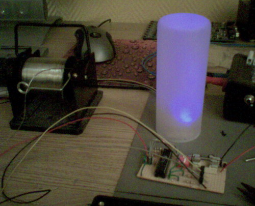

## Source code for project: [Mood light #1](https://link.stdout.no/B)

Simple mood lamp controller with three PWM channels, max 100 mA output pr channel. Uses the AVR ATmega8 microcontroller.

Written in basic, using [Bascom-AVR](http://www.mcselec.com/).

### Author
[Thomas Jensen](https://thomas.stdout.no)
